# AI Template Converter API

[](https://github.com/your-username/ai-template-converter)
[](LICENSE)
[](docker-compose.yml)
[](http://localhost:3000/api-docs)

A comprehensive REST API for converting AI-generated educational content to VoiceIdeal Studio templates. This production-ready system supports multiple template formats, provides real-time conversion capabilities, and includes comprehensive documentation and monitoring.

## 🚀 Features

### Core Functionality
- **AI Content Conversion**: Transform AI-generated educational content into VoiceIdeal Studio-compatible templates
- **Multi-Format Support**: Handle Capsule and XL template formats with specialized processing
- **Real-time Processing**: Fast conversion with detailed progress tracking and statistics
- **Template Management**: Dynamic template discovery and cataloging system

### API Capabilities
- **RESTful Design**: Clean, intuitive API endpoints following REST principles
- **File Upload Support**: Multipart form-data upload for AI output and template files
- **URL-based Conversion**: Process existing files using server-side paths
- **Batch Operations**: Support for multiple file processing workflows
- **Health Monitoring**: Comprehensive health checks and system status reporting

### Enterprise Features
- **Docker Containerization**: Production-ready container deployment
- **Swagger Documentation**: Interactive API documentation with live testing
- **Error Handling**: Robust error management with detailed logging
- **Security**: CORS, Helmet security headers, and input validation
- **Monitoring**: Request logging, performance metrics, and health endpoints

## 📋 Table of Contents

- [Quick Start](#-quick-start)
- [Installation](#-installation)
- [API Documentation](#-api-documentation)
- [Template Support](#-template-support)
- [Docker Deployment](#-docker-deployment)
- [Development](#-development)
- [Testing](#-testing)
- [Configuration](#-configuration)
- [Contributing](#-contributing)
- [License](#-license)

## 🔄 System Architecture

### High-Level Architecture Flow


### API Request Flow


### Template Processing Flow

```mermaid
graph LR
    A[AI Output JSON] --> B[Extract Course Info]
    A --> C[Extract Sections]
    A --> D[Extract Quizzes]
    
    B --> E[Map Course Tags]
    C --> F[Map Section Tags]
    D --> G[Map Quiz Tags]
    
    E --> H[Template Engine]
    F --> H
    G --> H
    
    H --> I[Tag Replacement]
    I --> J[Generate Output]
    J --> K[VoiceIdeal Template]
    
    subgraph "Tag Mapping Examples"
        L["training-title → Course Title"]
        M["type1_1:title → Section Title"]
        N["type1_1:imageurl → Section Image"]
        O["question-* → Quiz Questions"]
    end
    
    H --> L
    H --> M
    H --> N
    H --> O
```



### Deployment Flow


## 🚀 Quick Start

### Prerequisites

- Node.js 16+ 
- Docker & Docker Compose
- Git

### 1. Clone the Repository

```bash
git clone https://github.com/your-username/ai-template-converter.git
cd ai-template-converter
```

### 2. Start with Docker (Recommended)

```bash
# Build and start the API
docker-compose up --build -d

# Verify the API is running
curl http://localhost:3000/api/health
```

### 3. Test the API

```bash
# Check API status
curl http://localhost:3000/api/health

# View available templates
curl http://localhost:3000/api/convert/templates

# Convert a file (example)
curl -X POST http://localhost:3000/api/convert/url \
  -H "Content-Type: application/json" \
  -d '{
    "aiOutputPath": "/project/ÖRNEK-AI-ÇIKTILAR (1)/CAPSULE-ai_result_sample_Capsule_black_27-08-2025.json",
    "templatePath": "/project/scene_templates/Capsule-Siyah/Capsule-Siyah.json"
  }'
```

### 4. Access Documentation

Visit [http://localhost:3000/api-docs](http://localhost:3000/api-docs) for interactive API documentation.

## 🛠 Installation

### Option 1: Docker (Recommended for Production)

```bash
# Clone and start
git clone https://github.com/your-username/ai-template-converter.git
cd ai-template-converter
docker-compose up -d

# The API will be available at http://localhost:3000
```

### Option 2: Local Development

```bash
# Clone repository
git clone https://github.com/your-username/ai-template-converter.git
cd ai-template-converter

# Install dependencies
cd converter-api
npm install

# Build TypeScript
npm run build

# Start development server
npm run dev

# Or start production server
npm start
```

## 📚 API Documentation

### Base URL
```
http://localhost:3000
```

### Authentication
Currently, the API operates without authentication. For production deployments, implement appropriate authentication mechanisms.

### Endpoints

#### Health Check
```http
GET /api/health
GET /api/health/detailed
```

#### Conversion
```http
POST /api/convert              # File upload conversion
POST /api/convert/url          # URL-based conversion
GET /api/convert/templates     # List available templates
GET /api/convert/outputs       # List converted outputs
```

#### Documentation
```http
GET /api-docs                  # Swagger UI documentation
GET /                          # API information
```

### Request Examples

#### File Upload Conversion
```bash
curl -X POST http://localhost:3000/api/convert \
  -F "aiOutput=@ai-output.json" \
  -F "template=@template.json"
```

#### URL-based Conversion
```bash
curl -X POST http://localhost:3000/api/convert/url \
  -H "Content-Type: application/json" \
  -d '{
    "aiOutputPath": "/path/to/ai-output.json",
    "templatePath": "/path/to/template.json"
  }'
```

### Response Format

#### Success Response
```json
{
  "success": true,
  "message": "Conversion completed successfully",
  "data": {
    "outputPath": "/app/outputs/converted/converted-2025-10-19T13-05-27-420Z.json",
    "downloadUrl": "/outputs/converted/converted-2025-10-19T13-05-27-420Z.json",
    "stats": {
      "sections": 16,
      "quizzes": 3,
      "totalTags": 91,
      "replacedTags": 91
    },
    "fileSize": "0.00 MB"
  }
}
```

#### Error Response
```json
{
  "success": false,
  "error": {
    "message": "Error description",
    "statusCode": 400
  }
}
```

## 🎯 Template Support

### Supported Template Types

#### Capsule Templates
- **Capsule-Default**: Standard capsule template
- **Capsule-Siyah**: Black-themed capsule template
- **Capsule-YEŞİL**: Green-themed capsule template
- **Capsule-MAVİ**: Blue-themed capsule template
- **Capsule-SAMSUNG**: Samsung-branded capsule template
- **Capsule-CREATIO**: Creatio-specific capsule template

#### XL Templates
- **XL-MAVİ**: Blue-themed XL template
- **XL-SAMSUNG**: Samsung-branded XL template
- **XL-Sompo**: Sompo-specific XL template

### Template Structure

Templates follow the VoiceIdeal Studio format with dynamic tag replacement:

```json
{
  "training-title": "Dynamic Course Title",
  "training-description": "Dynamic Course Description",
  "type1_1:title": "Section Title",
  "type1_1:imageurl": "Section Image URL",
  "type1_1:audioduration": 120,
  "type1_1:speech": "Audio File URL"
}
```

### Tag Mapping

The system automatically maps AI output fields to template tags:

- **Course Information**: `training-title`, `training-description`
- **Section Data**: `type{number}:title`, `type{number}:imageurl`
- **Audio Content**: `type{number}:speech`, `type{number}:audioduration`
- **Quiz Data**: `question-*` tags for quiz content

## 🐳 Docker Deployment

### Docker Compose

The project includes a complete Docker setup:

```yaml
version: '3.8'

services:
  converter-api:
    build:
      context: ./converter-api
      dockerfile: Dockerfile
    ports:
      - "3000:3000"
    volumes:
      - /path/to/templates:/templates:ro
      - ./converter-api/outputs:/app/outputs
      - ./converter-api/uploads:/app/uploads
    environment:
      - NODE_ENV=production
      - PORT=3000
    restart: unless-stopped
    healthcheck:
      test: ["CMD", "node", "-e", "require('http').get('http://localhost:3000/api/health', (res) => { process.exit(res.statusCode === 200 ? 0 : 1) })"]
      interval: 30s
      timeout: 10s
      retries: 3
      start_period: 40s
```

### Docker Commands

```bash
# Build and start
docker-compose up --build -d

# View logs
docker-compose logs -f

# Stop services
docker-compose down

# Restart services
docker-compose restart
```

### Environment Variables

| Variable | Default | Description |
|----------|---------|-------------|
| `NODE_ENV` | `production` | Environment mode |
| `PORT` | `3000` | API server port |
| `LOG_LEVEL` | `info` | Logging level |

## 💻 Development

### Project Structure

```
ai-template-converter/
├── converter-api/           # REST API implementation
│   ├── src/
│   │   ├── config/         # Configuration files
│   │   ├── controllers/    # Request controllers
│   │   ├── middleware/     # Express middleware
│   │   ├── routes/         # API routes
│   │   ├── services/       # Business logic
│   │   ├── types/          # TypeScript types
│   │   ├── utils/          # Utility functions
│   │   └── server.ts       # Main server file
│   ├── uploads/            # Upload directory
│   ├── outputs/            # Output directory
│   ├── Dockerfile          # Docker configuration
│   └── package.json        # Dependencies
├── converter/              # Core converter library
├── scene_templates/        # Template files
├── XLSamples/             # XL template samples
├── docker-compose.yml     # Docker orchestration
└── README.md             # This file
```

### Development Setup

```bash
# Install dependencies
cd converter-api
npm install

# Start development server with hot reload
npm run dev:watch

# Build for production
npm run build

# Run tests
npm test
```

### Code Standards

- **TypeScript**: Strict type checking enabled
- **ESLint**: Code linting with Airbnb configuration
- **Prettier**: Code formatting
- **Jest**: Unit testing framework
- **Swagger**: API documentation standards

## 🧪 Testing

### API Testing

```bash
# Health check
curl http://localhost:3000/api/health

# Template listing
curl http://localhost:3000/api/convert/templates

# Conversion test
curl -X POST http://localhost:3000/api/convert/url \
  -H "Content-Type: application/json" \
  -d '{
    "aiOutputPath": "/project/sample-ai-output.json",
    "templatePath": "/project/sample-template.json"
  }'
```

### Load Testing

```bash
# Install artillery
npm install -g artillery

# Run load test
artillery quick --count 10 --num 5 http://localhost:3000/api/health
```

### Integration Testing

The API includes comprehensive integration tests covering:
- File upload functionality
- Template processing
- Error handling
- Response validation

## ⚙️ Configuration

### File Limits

- **Maximum file size**: 50MB
- **Supported formats**: JSON only
- **Concurrent uploads**: Limited by server resources

### Performance Tuning

```javascript
// Environment-specific configurations
const config = {
  development: {
    port: 3000,
    logLevel: 'debug',
    cors: { origin: '*' }
  },
  production: {
    port: process.env.PORT || 3000,
    logLevel: 'info',
    cors: { origin: process.env.ALLOWED_ORIGINS?.split(',') }
  }
};
```

### Monitoring

The API includes built-in monitoring capabilities:

- **Health endpoints**: `/api/health`, `/api/health/detailed`
- **Request logging**: Morgan middleware
- **Error tracking**: Comprehensive error logging
- **Performance metrics**: Response time tracking

## 🤝 Contributing

We welcome contributions! Please follow these guidelines:

### Development Process

1. **Fork** the repository
2. **Create** a feature branch (`git checkout -b feature/amazing-feature`)
3. **Commit** your changes (`git commit -m 'Add amazing feature'`)
4. **Push** to the branch (`git push origin feature/amazing-feature`)
5. **Open** a Pull Request

### Code Guidelines

- Follow TypeScript best practices
- Write comprehensive tests
- Update documentation
- Follow conventional commit messages
- Ensure all tests pass

### Pull Request Requirements

- [ ] Code follows project standards
- [ ] Tests are included and passing
- [ ] Documentation is updated
- [ ] No breaking changes (or clearly documented)

## 📄 License

This project is licensed under the MIT License - see the [LICENSE](LICENSE) file for details.

## 🆘 Support

### Documentation
- [API Documentation](http://localhost:3000/api-docs)
- [Template Guide](docs/template-guide.md)
- [Deployment Guide](docs/deployment.md)

### Community
- [GitHub Issues](https://github.com/your-username/ai-template-converter/issues)
- [Discussions](https://github.com/your-username/ai-template-converter/discussions)

### Professional Support
For enterprise support and custom implementations, contact: support@example.com

## 🏷️ Version History

### v0.0.1 (Current)
- Initial release
- REST API implementation
- Docker containerization
- Swagger documentation
- Capsule and XL template support
- File upload and URL-based conversion
- Health monitoring
- Comprehensive error handling

---

**Made with ❤️ by the AI Template Converter Team**

*Transforming AI content into professional educational templates since 2025*
