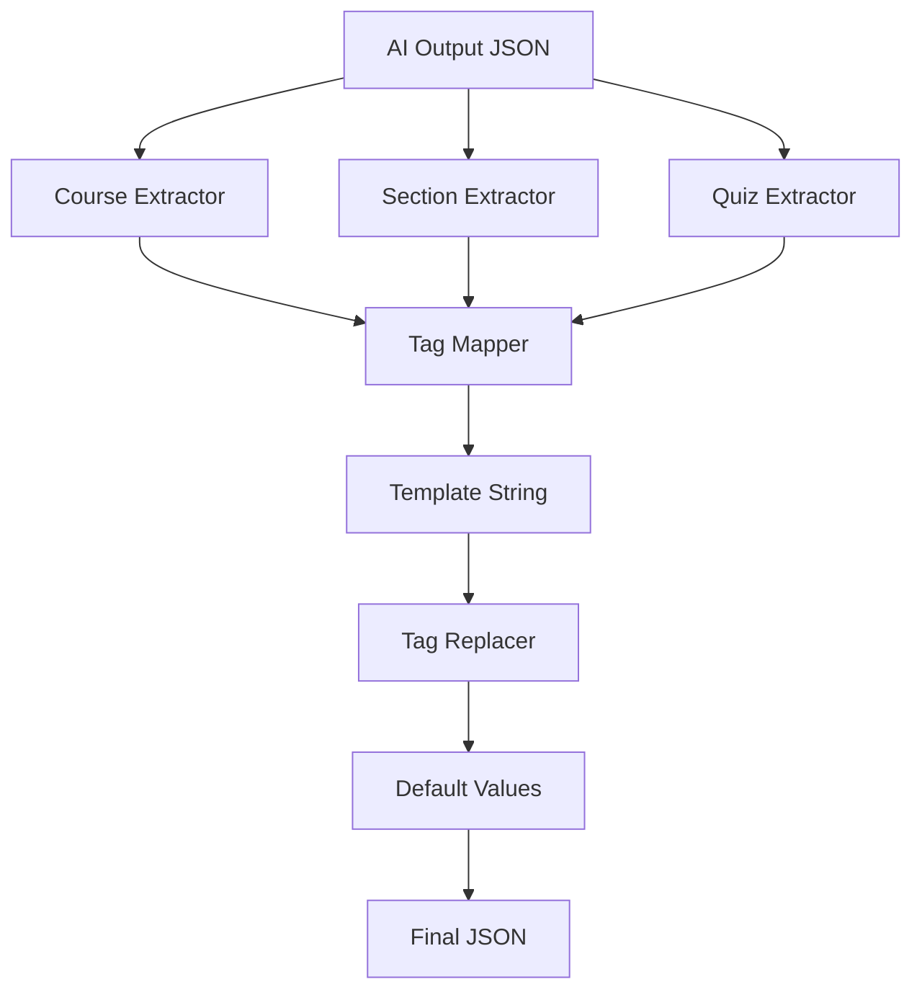

# AI-to-Template Converter - Kapsamlı Dokümantasyon

## 📋 İçindekiler

1. [Proje Genel Bakış](#proje-genel-bakış)
2. [Sistem Mimarisi](#sistem-mimarisi)
3. [Kurulum](#kurulum)
4. [Kullanım](#kullanım)
5. [Template Sistemi](#template-sistemi)
6. [API Referansı](#api-referansı)
7. [Örnekler](#örnekler)
8. [Troubleshooting](#troubleshooting)
9. [Geliştirici Rehberi](#geliştirici-rehberi)

---

## 🎯 Proje Genel Bakış

### Ne İşe Yarar?

**AI-to-Template Converter**, AI tarafından üretilen eğitim içeriklerini (JSON formatında) önceden tanımlanmış template'lere dönüştüren bir TypeScript uygulamasıdır.

### Temel Özellikler

- ✅ **Multi-Template Support**: Farklı template türlerini destekler
- ✅ **Otomatik Tag Replacement**: `#{[tag]}#` formatındaki placeholder'ları otomatik değiştirir
- ✅ **Type Safety**: TypeScript ile tip güvenliği
- ✅ **CLI Interface**: Komut satırı arayüzü
- ✅ **Error Handling**: Kapsamlı hata yönetimi
- ✅ **Default Values**: Eksik tag'lar için otomatik varsayılan değerler
- ✅ **Logging**: Detaylı log sistemi

### Desteklenen Template Türleri

| Template | Boyut | Özellikler |
|----------|-------|------------|
| **Capsule** | ~285KB | Kısa eğitimler, temel içerik |
| **XL** | ~1MB | Kapsamlı eğitimler, detaylı içerik |
| **Mini/Midi/Maxi** | Değişken | Farklı boyutlarda eğitimler |

---

## 🏗️ Sistem Mimarisi

```
converter/
├── src/
│   ├── types/           # TypeScript tip tanımları
│   ├── extractors/      # AI çıktısından veri çıkarma
│   ├── mappers/         # PageStyle -> Type dönüşümü
│   ├── processors/      # Tag işleme ve değiştirme
│   ├── utils/           # Yardımcı fonksiyonlar
│   ├── converter.ts     # Ana dönüştürme sınıfı
│   ├── cli.ts          # Komut satırı arayüzü
│   └── index.ts        # Giriş noktası
├── config/
│   └── mappings.json   # PageStyle -> Type eşleştirmesi
├── output/             # Çıktı dosyaları
└── README.md
```

### Veri Akışı



---

## 🚀 Kurulum

### Gereksinimler

- Node.js 16+ 
- npm veya yarn

### Adım Adım Kurulum

```bash
# 1. Proje dizinine git
cd /path/to/JsonArge/converter

# 2. Bağımlılıkları yükle
npm install

# 3. TypeScript'i derle (opsiyonel)
npm run build

# 4. Test et
npm run convert -- --help
```

### Package.json Bağımlılıkları

```json
{
  "dependencies": {
    "commander": "^11.0.0",
    "fs-extra": "^11.1.1",
    "chalk": "^4.1.2"
  },
  "devDependencies": {
    "typescript": "^5.0.0",
    "ts-node": "^10.9.0"
  }
}
```

---

## 💻 Kullanım

### Temel Kullanım

```bash
npm run convert -- convert \
  --ai-output "path/to/ai-output.json" \
  --template "path/to/template.json" \
  --output "path/to/output.json"
```

### Parametreler

| Parametre | Açıklama | Zorunlu |
|-----------|----------|---------|
| `--ai-output` | AI çıktısı JSON dosyası | ✅ |
| `--template` | Template JSON dosyası | ✅ |
| `--output` | Çıktı dosyası yolu | ✅ |
| `--verbose` | Detaylı log çıktısı | ❌ |

### Örnek Komutlar

```bash
# Basit dönüştürme
npm run convert -- convert \
  --ai-output "../ai-output.json" \
  --template "../template.json" \
  --output "./output.json"

# Detaylı log ile
npm run convert -- convert \
  --ai-output "../ai-output.json" \
  --template "../template.json" \
  --output "./output.json" \
  --verbose

# Farklı template türleri
npm run convert -- convert \
  --ai-output "../capsule-ai.json" \
  --template "/templates/capsule-black.json" \
  --output "./capsule-output.json"

npm run convert -- convert \
  --ai-output "../xl-ai.json" \
  --template "/templates/xl-blue.json" \
  --output "./xl-output.json"
```

---

## 🎨 Template Sistemi

### Tag Formatı

Template'lerde kullanılan tag formatı:
```
#{[tag-name]}#
```

### Tag Kategorileri

#### 1. **Global Tags**
```json
{
  "#{[training-title]}#": "Eğitim Başlığı",
  "#{[training-description]}#": "Eğitim Açıklaması",
  "#{[ai-mandatory]}#": "false"
}
```

#### 2. **Scene-Specific Tags**
```json
{
  "#{[type0:title]}#": "Kapak Sayfası Başlığı",
  "#{[type0:speech]}#": "Kapak Sayfası Konuşması",
  "#{[type1_1:title]}#": "İçerik Başlığı",
  "#{[type1_1:paragraph]}#": "İçerik Paragrafı"
}
```

#### 3. **Quiz Tags**
```json
{
  "#{[type12_12:speech]}#": "Quiz Sorusu",
  "#{[type12_12:audioduration]}#": 5
}
```

### PageStyle Mapping

AI çıktısındaki `PageStyle` değerleri template'deki `Type` değerlerine dönüştürülür:

```json
{
  "pageStyleToType": {
    "26": "type1_1",
    "27": "type2_2", 
    "15": "type9_9",
    "21": "type8_8",
    "4": "type4_4",
    "100": "type100",
    "101": "type101"
  }
}
```

---

## 📚 API Referansı

### Ana Sınıf: AIToTemplateConverter

```typescript
import { AIToTemplateConverter, ConverterOptions } from './converter';

const options: ConverterOptions = {
  aiOutputPath: 'path/to/ai-output.json',
  templatePath: 'path/to/template.json', 
  outputPath: 'path/to/output.json',
  verbose: true
};

const converter = new AIToTemplateConverter(options);
await converter.convert();
```

### Extractor Sınıfları

#### CourseExtractor
```typescript
import { CourseExtractor } from './extractors/course-extractor';
import { AIOutput } from './types/ai-output';

const aiOutput: AIOutput = await FileUtils.readJson('ai-output.json');
const courseTags = CourseExtractor.extract(aiOutput);
```

#### SectionExtractor
```typescript
import { SectionExtractor } from './extractors/section-extractor';

const sectionTags = SectionExtractor.extract(aiOutput);
```

#### QuizExtractor
```typescript
import { QuizExtractor } from './extractors/quiz-extractor';

const quizTags = QuizExtractor.extract(aiOutput);
```

### TagReplacer Utility

```typescript
import { TagReplacer } from './processors/tag-replacer';

// Tag'ları değiştir
const result = TagReplacer.replaceTags(templateString, tagMap);

// Değiştirilmemiş tag'ları bul
const unreplacedTags = TagReplacer.findUnreplacedTags(result);

// Tag ismini çıkar
const tagName = TagReplacer.extractTagName("#{[training-title]}#");

// Tag map'leri birleştir
const mergedTags = TagReplacer.mergeTagMaps(tags1, tags2, tags3);
```

---

## 📖 Örnekler

### Örnek 1: Basit Capsule Dönüştürme

```bash
# AI çıktısı
{
  "CourseInfo": {
    "Title": "Güvenli Yazılım Geliştirme",
    "Description": "Bu eğitim yazılım güvenliği konularını kapsar..."
  },
  "Sections": [
    {
      "PageStyle": 26,
      "Title": "Güvenlik Temelleri",
      "Content": {"paragraph": "Güvenlik önemli bir konudur..."}
    }
  ]
}

# Template
{
  "globalConfig": {
    "title": "#{[training-title]}#"
  },
  "pages": {
    "type1_1": {
      "title": "#{[type1_1:title]}#",
      "content": "#{[type1_1:paragraph]}#"
    }
  }
}

# Çıktı
{
  "globalConfig": {
    "title": "Güvenli Yazılım Geliştirme"
  },
  "pages": {
    "type1_1": {
      "title": "Güvenlik Temelleri", 
      "content": "Güvenlik önemli bir konudur..."
    }
  }
}
```

### Örnek 2: XL Template ile Kapsamlı Eğitim

```bash
npm run convert -- convert \
  --ai-output "../xl-sample.json" \
  --template "/templates/xl-blue.json" \
  --output "./xl-result.json" \
  --verbose
```

### Örnek 3: Farklı Template Türleri

```bash
# Black Template
npm run convert -- convert \
  --ai-output "../ai-output.json" \
  --template "/templates/capsule-black.json" \
  --output "./black-output.json"

# Green Template  
npm run convert -- convert \
  --ai-output "../ai-output.json" \
  --template "/templates/capsule-green.json" \
  --output "./green-output.json"

# Default Template
npm run convert -- convert \
  --ai-output "../ai-output.json" \
  --template "/templates/capsule-default.json" \
  --output "./default-output.json"
```

---

## 🔧 Troubleshooting

### Yaygın Hatalar ve Çözümleri

#### 1. **JSON Parse Error**
```
Error: Unexpected token '#', ..."eedback": #{[questio"... is not valid JSON
```

**Çözüm**: Tag'lar tam olarak değiştirilmemiş. Default values sistemi devreye girer.

#### 2. **PageStyle Mapping Error**
```
⚠️ Unknown PageStyle: 99, using fallback
```

**Çözüm**: `config/mappings.json` dosyasına yeni mapping ekleyin:
```json
{
  "pageStyleToType": {
    "99": "type99_99"
  }
}
```

#### 3. **File Not Found**
```
Error: ENOENT: no such file or directory
```

**Çözüm**: Dosya yollarını kontrol edin:
```bash
ls -la path/to/your/files
```

#### 4. **Template Structure Error**
```
Error: Failed to parse output as JSON
```

**Çözüm**: Template'in geçerli JSON formatında olduğundan emin olun.

### Debug Modu

Detaylı debug bilgisi için:
```bash
npm run convert -- convert \
  --ai-output "input.json" \
  --template "template.json" \
  --output "output.json" \
  --verbose
```

### Log Seviyeleri

- **INFO**: Temel işlem bilgileri
- **DEBUG**: Detaylı işlem adımları (verbose mode)
- **WARN**: Uyarılar (PageStyle mapping vb.)
- **ERROR**: Hata mesajları

---

## 👨‍💻 Geliştirici Rehberi

### Proje Yapısı

```
src/
├── types/
│   ├── ai-output.ts      # AI çıktısı tipleri
│   └── config.ts         # Konfigürasyon tipleri
├── extractors/
│   ├── course-extractor.ts    # Kurs bilgisi çıkarıcı
│   ├── section-extractor.ts   # Bölüm bilgisi çıkarıcı
│   └── quiz-extractor.ts      # Quiz bilgisi çıkarıcı
├── mappers/
│   └── pagestyle-mapper.ts    # PageStyle -> Type mapper
├── processors/
│   └── tag-replacer.ts        # Tag değiştirici
├── utils/
│   ├── file-utils.ts          # Dosya işlemleri
│   ├── logger.ts              # Log sistemi
│   └── default-values.ts      # Varsayılan değerler
├── converter.ts               # Ana dönüştürücü
├── cli.ts                     # CLI arayüzü
└── index.ts                   # Giriş noktası
```

### Yeni Extractor Ekleme

```typescript
// src/extractors/new-extractor.ts
import { AIOutput } from '../types/ai-output';
import { TagMapping } from '../types/config';
import { Logger } from '../utils/logger';

export class NewExtractor {
  static extract(aiOutput: AIOutput): TagMapping {
    Logger.debug('Extracting new data...');
    const tags: TagMapping = {};
    
    // Extraction logic here
    
    Logger.debug(`Extracted ${Object.keys(tags).length} tags.`);
    return tags;
  }
}
```

### Yeni Template Türü Desteği

1. **Mapping ekle** (`config/mappings.json`):
```json
{
  "pageStyleToType": {
    "newPageStyle": "newType"
  }
}
```

2. **Default values ekle** (`src/utils/default-values.ts`):
```typescript
private static defaults: TagMapping = {
  'newType:title': 'Yeni Başlık',
  'newType:speech': 'Yeni Konuşma'
};
```

### Test Etme

```bash
# TypeScript derleme
npm run build

# Test çalıştırma
npm run convert -- convert \
  --ai-output "test-data.json" \
  --template "test-template.json" \
  --output "test-output.json" \
  --verbose
```

### Kod Standartları

- **TypeScript**: Strict mode aktif
- **Naming**: camelCase fonksiyonlar, PascalCase sınıflar
- **Error Handling**: Try-catch blokları
- **Logging**: Her önemli işlem için log
- **Documentation**: JSDoc yorumları

---

## 📝 Changelog

### v1.0.0 (2025-01-15)
- ✅ İlk sürüm
- ✅ Capsule ve XL template desteği
- ✅ Otomatik tag replacement
- ✅ Default values sistemi
- ✅ CLI interface
- ✅ Comprehensive logging

---

## 🤝 Katkıda Bulunma

1. Fork yapın
2. Feature branch oluşturun (`git checkout -b feature/amazing-feature`)
3. Commit yapın (`git commit -m 'Add amazing feature'`)
4. Push yapın (`git push origin feature/amazing-feature`)
5. Pull Request oluşturun

---

## 📄 Lisans

Bu proje MIT lisansı altında lisanslanmıştır.

---

## 📞 İletişim

- **Proje**: AI-to-Template Converter
- **Versiyon**: 1.0.0
- **Son Güncelleme**: 15 Ocak 2025

---

*Bu dokümantasyon AI-to-Template Converter projesi için hazırlanmıştır.*


